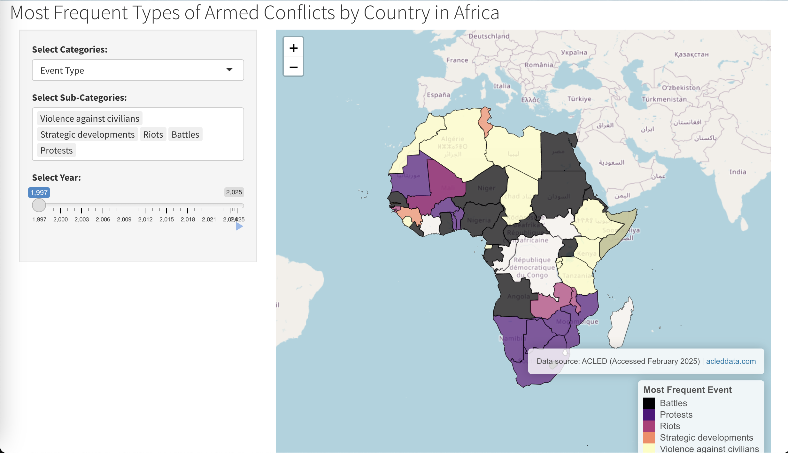

# Africa-Conflict-Analysis
This project analyzes and visualizes conflict-related data across Africa from 1997 to 2025. It integrates geographic and event data to map the most frequent types of conflicts by country, helping to identify trends and patterns in conflict dynamics over time. The analysis is presented through an interactive Shiny web application.

## The analysis is presented through an interactive **Shiny web application**.
[View the live app here](https://firassel.shinyapps.io/AfricaConflictAnalysis/)

### **App Preview**

## 📊 Data Source
**ACLED (Accessed February 2025) | [acleddata.com](https://acleddata.com/)**

ACLED (Armed Conflict Location & Event Data Project) provides real-time conflict data across the world.  
This project utilizes ACLED data to analyze conflict trends in Africa from 1997 to 2025.
